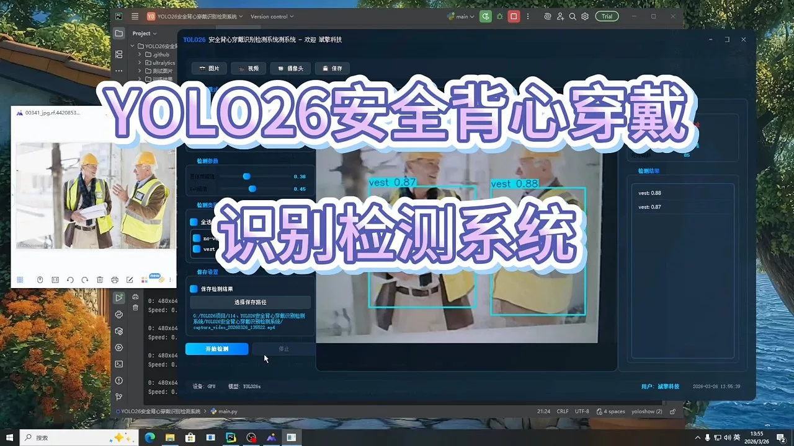
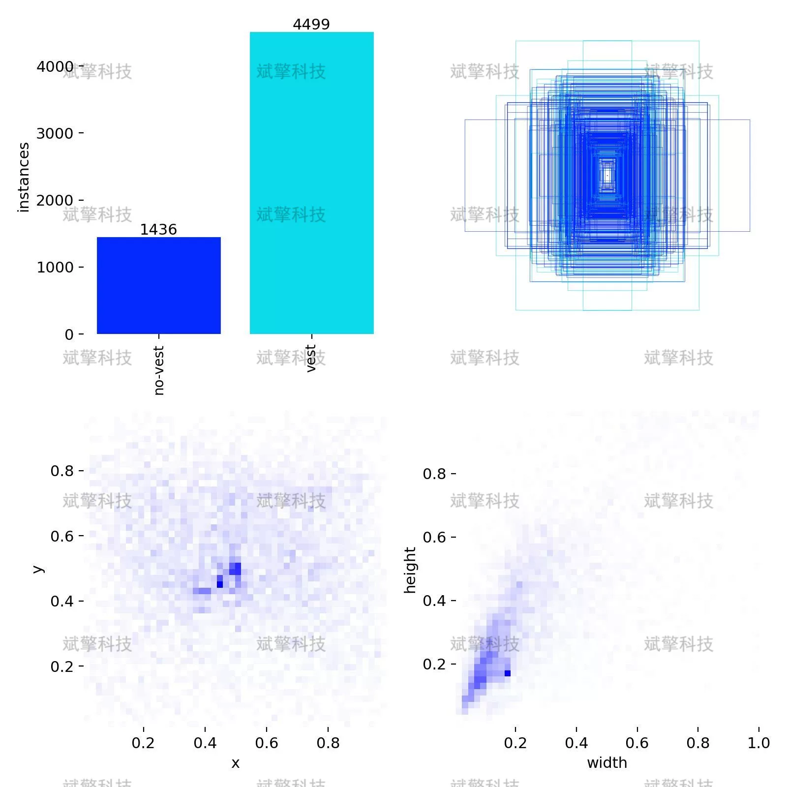
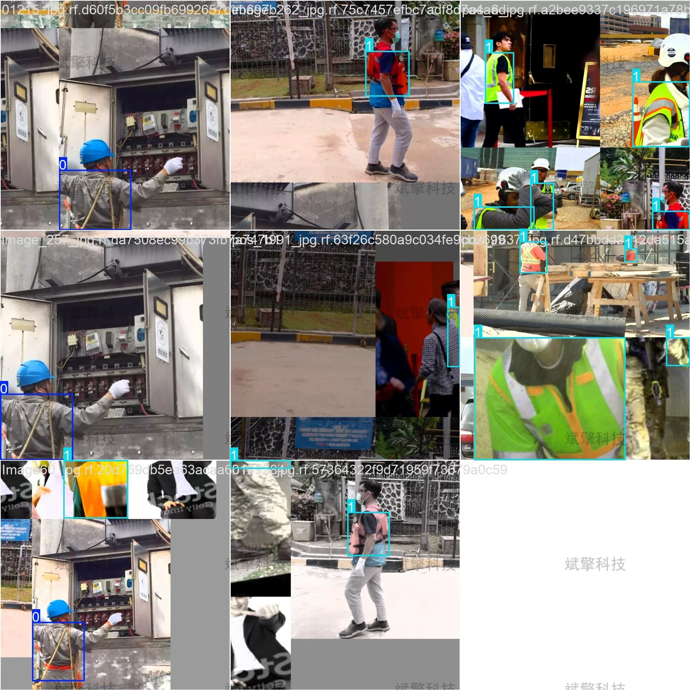
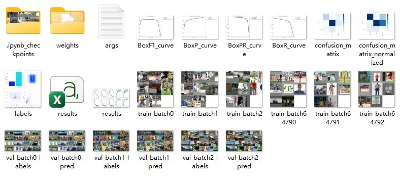
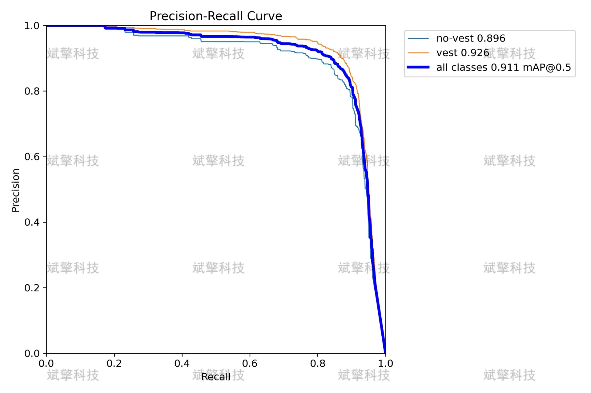
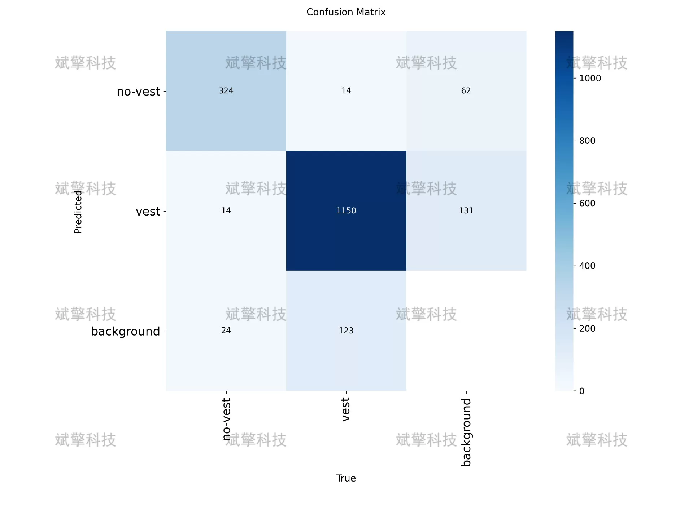
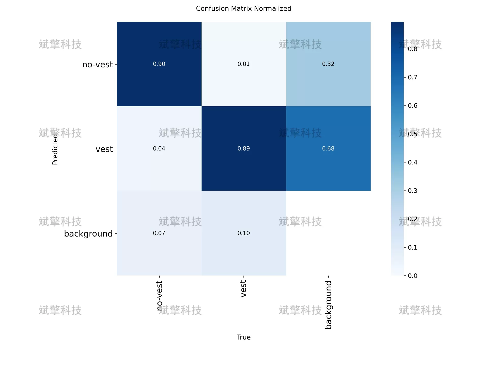
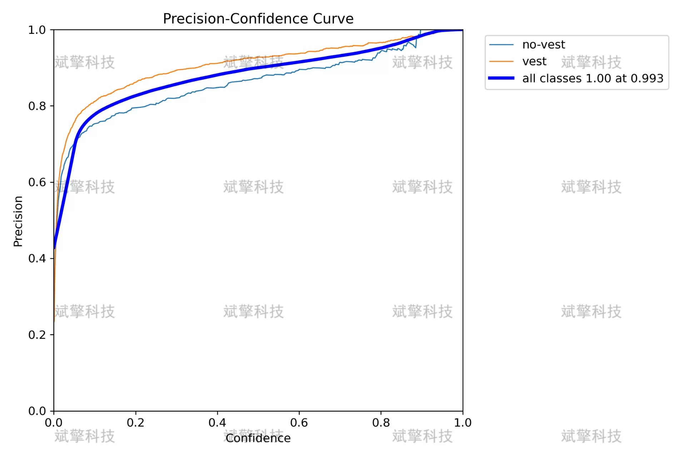
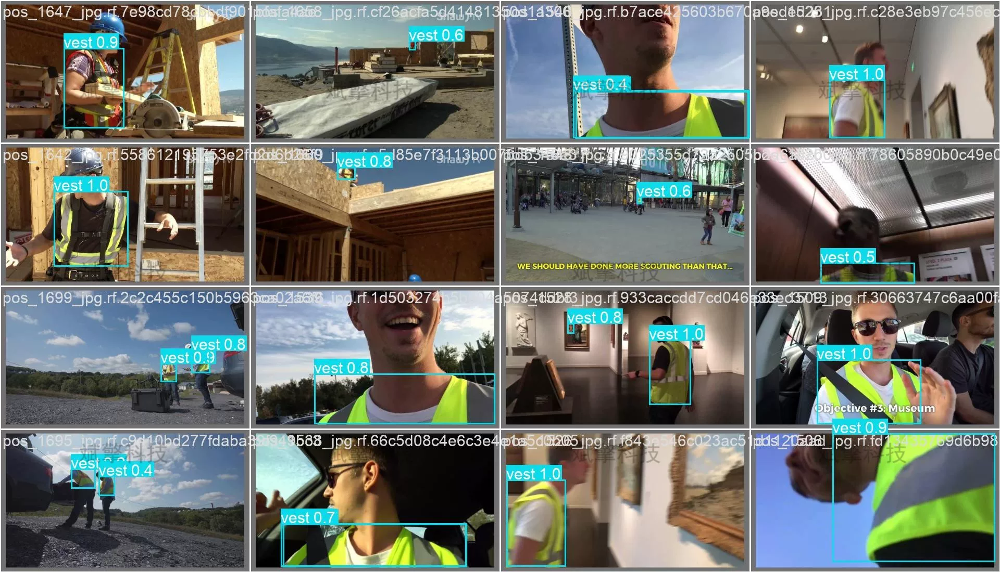

# YOLO26 Security Vest Wearable Recognition and Detection System

## Body

YOLO26 Safety Vest Wear Detection System: A Full-Process Realization from Dataset Construction to Industrial Scenario Deployment

Safety vest wear detection is an important technical means for ensuring the safety of industrial work sites. This paper builds a wear recognition system for two categories of targets (no-vest, vest) based on the YOLO26 object detection algorithm. The system was trained using 2728 images, validated with 779 images, and tested with 390 images. The experimental results show that the model achieves an mAP@0.5 metric of 0.911, with vest class AP at 0.926 and no-vest class AP at 0.896, demonstrating good detection performance. This study provides a feasible technical solution for the detection of industrial site safety equipment.

The dataset used in this system includes two categories of targets: no-vest (not wearing a safety vest) and vest (wearing a safety vest). The dataset is divided as follows:
Training set: 2728 images
Validation set: 779 images
Test set: 390 images

Free reservation for remote installation. Unsuccessful refund without success.
Purchase Enjoy the following resources (Baidu Pan download unlocked automatically)
   YOLO Identification Detection Project Complete Source Code
    YOLO format dataset
    Training code + UI interface code
    Trained model + result image
    Software install package
    Add WeChat reservation for remote installation (Automatically display WeChat ID after purchase) - Unsuccessful full refund

⚙️ Core Function Modules
Detection Capability
    Image detection: upload and check immediately, return detection box + category information
    Video detection: supports video files, analyze each frame accurately
    Camera real-time detection: connect USB camera, realize dynamic monitoring
Interaction and Control
    Target selection: freely choose one or more categories for detection
    Parameter real-time adjustment: adjustable confidence threshold & IoU threshold, flexible control accuracy
    Result saving: one-click save of image/video/camera detection results
System and Data
    User login registration: support password strength detection + encryption storage
    Log recording: automatically record operation and error information (with timestamp)

## Images

## Payment

Here is a pay link on Stripe ( https://buy.stripe.com/3cs8yP7sY87d0vu9AB ). Please contact me lonlonago@foxmail.com after funding $89, and I will send you a complete data files , thank you!

